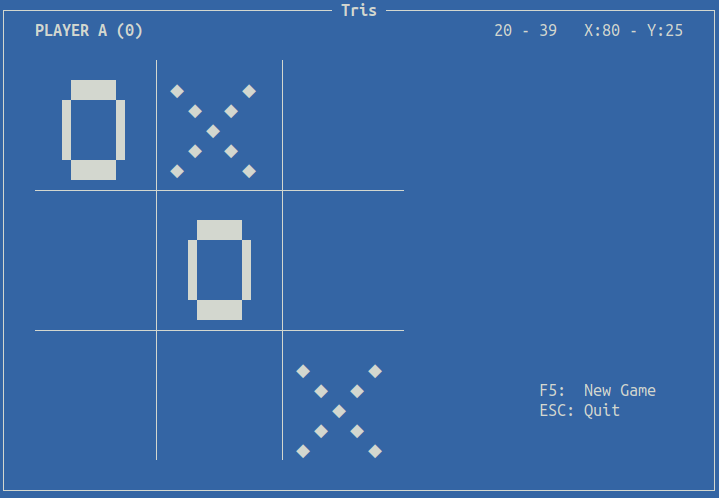
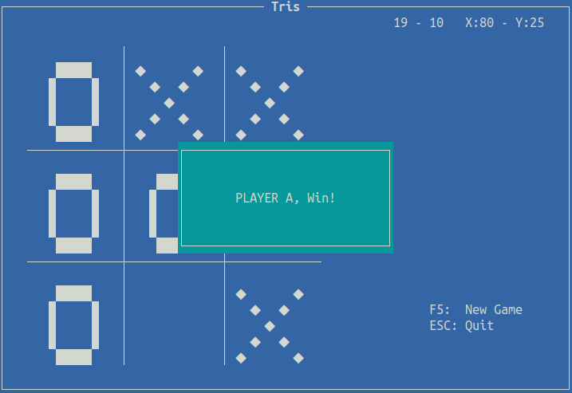
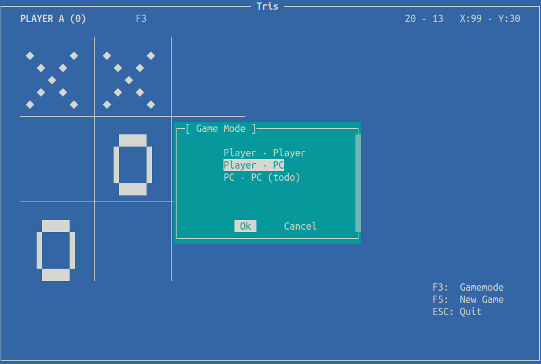

# tris
terminal tris game with ncurses, implementation in c for linux, using the mouse.

## game images

## controls

- Esc : Quit Game
- F3: Change Gamemode
    1. Player vs Player
    2. Player vs PC
- F5: New Match
- Mouse click on the cell to play

## how to compile

1. make
2. make run

## Info
For the game mode (PLAYER_PC), for PC movements, I implemented a basic random walk generator

### Dependencies
Before compiling make sure you have ncurses dev install
